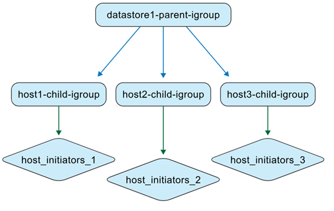
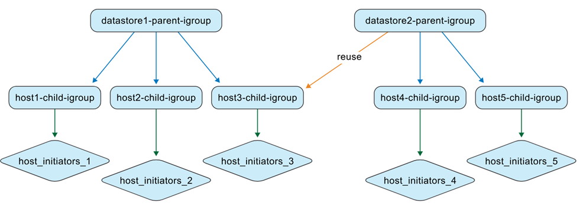
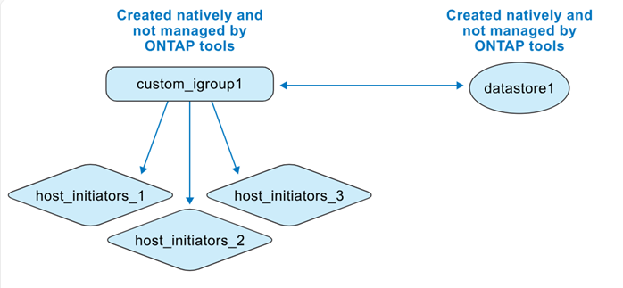

= Understand ONTAP tools managed igroups
:icons: font
:imagesdir: ../media/

[.lead]
When managing both ONTAP tools VMs and ONTAP storage systems, understanding igroup behavior is essential, especially when migrating datastores from non-ONTAP tools environments to ONTAP tools management. This section describes how igroups are updated during this transition.

ONTAP tools for VMware vSphere 10.4 simplifies datastore management by automating the creation and maintenance of ONTAP and vCenter objects within VMware datacenter environments. 

ONTAP tools for VMware vSphere 10.4 interprets igroups in two different contexts:

// new topic for 10.5
.Non-ONTAP tools managed igroups

As a storage administrator, you can create igroups on the ONTAP system as flat or nested structures. The illustration shows a flat igroup created in the ONTAP system.

image:../media/non-otv-managed.png[Non-ONTAP tools managed igroup]

.ONTAP tools managed igroups

When you create datastores, ONTAP tools for VMware vSphere 10.4 automatically creates igroups using a nested structure for easier LUN mapping. 

For example, when datastore1 is created and mounted on hosts 1, 2, and 3, and a new datastore (datastore2) is created and mounted on hosts 3, 4, and 5, ONTAP tools reuses the host-level igroup for efficient management.

Here are some cases for ONTAP tools for VMware vSphere supported igroups.

*When you create a datastore with default igroup settings*

When you create a datastore and leave the igroup field blank (default setting), ONTAP tools automatically generates a nested igroup structure for that datastore. The parent igroup at the datastore level is named using the pattern: otv_<vcguid>_<host_parent_datacenterMoref>_<datastore_name>. Each host-level child igroup follows the pattern: otv_<hostMoref>_<vcguid>. You can view the association between parent (datastore-level) and child (host-level) igroups in the *Parent Initiator Group* section of the ONTAP storage interface.

With the nested igroup approach, LUNs are mapped only to the child igroups. vCenter Server inventory then displays the new datastore.

*When you create a datastore with a custom igroup name*

During datastore creation in ONTAP tools, you can enter a custom igroup name instead of selecting from the dropdown. ONTAP tools then creates a parent igroup at the datastore level using your specified name. If the same host is used for multiple datastores, the existing host-level (child) igroup is reused. As a result, the LUN for the new datastore is mapped to this existing child igroup, which might now be associated with multiple parent igroups (one for each datastore). The vCenter Server user interface datastore list confirms the successful creation of the new datastore with the custom igroup name.

*When you reuse the igroup name during datastore creation*

When creating a datastore using the ONTAP tools user interface, you can choose an existing custom parent igroup from the drop-down list. After reusing the parent igroup to create another datastore, the ONTAP systems user interface shows this association. The new datastore also appears in the vCenter Server user interface.

This operation can also be performed using the API. To reuse an existing igroup during datastore creation, specify the igroup UUID in the API request payload.

*When you create a datastore and igroup natively from ONTAP and vCenter*

If you create the igroup and datastore directly in ONTAP systems and VMware environments, ONTAP tools does not manage these objects at first. This creates a flat igroup structure.

To manage an existing datastore and igroup with ONTAP tools, you should perform a datastore discovery. ONTAP tools identifies and registers the datastore and igroup, and converts them to a nested structure in its database. A new parent igroup is created using the custom name, while the existing igroup is renamed with the "otv_" prefix and becomes the child igroup. The initiator mappings remain unchanged. Only igroups mapped to datastores are converted during discovery. After this, the igroup structure looks like the illustration below.

image:../media/otv-ds.png[Datastore and igroup managed by ONTAP tools]

You can create a datastore directly in vCenter Server and later bring it under ONTAP tools management. First, create a flat igroup in ONTAP systems and map a LUN to it. After running datastore discovery in ONTAP tools, the flat igroup is converted to a nested structure. ONTAP tools then manages the igroup, renaming it with the 'otv_' prefix. The LUN remains mapped to the same igroup throughout this process.

*How ONTAP tools reuse igroups created natively*

You can provision a datastore in ONTAP tools using an igroup originally created in ONTAP systems, after it is managed by ONTAP tools. These igroups appear in the custom initiator group name drop-down list. The new LUN for the datastore is then mapped to the corresponding normalized child igroup, such as "otv_NativeIgroup1".

ONTAP tools for VMware vSphere does not detect or use igroups created in ONTAP system that are not managed by ONTAP tools or linked to a datastore.

